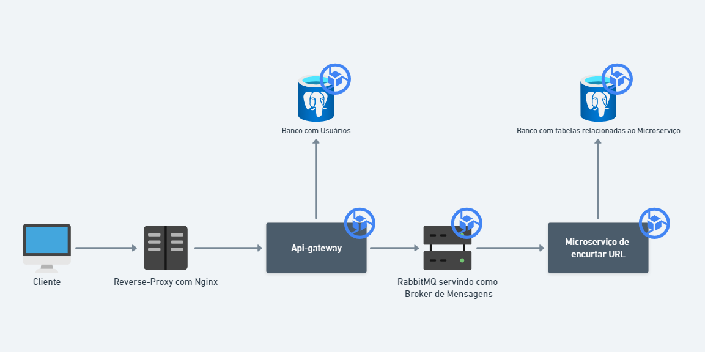

# Encurtador de URLs

Este é um serviço simples e eficiente para encurtamento de URLs, permitindo aos usuários criar, gerenciar e excluir URLs, com ou sem autenticação. URLs criadas com autenticação ficam vinculadas a uma conta de usuário, permitindo que o usuário realize ações como listar, editar, excluir (soft delete) e visualizar o número de acessos a cada URL.



## Tecnologias Utilizadas

- **Node.js (v22)**: Plataforma JavaScript para construção de aplicações escaláveis.
- **NestJS**: Framework para construir aplicações backend eficientes e escaláveis.
- **Prisma**: ORM utilizado para conexão com o banco de dados PostgreSQL e facilitação das operações de CRUD.
- **JWT (JSON Web Token)**: Utilizado para autenticação de usuários de forma segura.
- **bcryptjs**: Biblioteca para hash de senhas, garantindo segurança na autenticação.
- **RabbitMQ**: Sistema de mensageria utilizado para comunicação entre microserviços.
- **PostgreSQL**: Banco de dados relacional utilizado para armazenar dados da aplicação.
- **Swagger**: Utilizado para documentar e explorar as rotas da API.
- **Jest**: Framework de testes utilizado para testes unitários.
- **GitHub Actions**: Ferramenta de CI/CD para automação de linting e execução de testes.
- **Docker & Docker Compose**: Utilizados para facilitar o desenvolvimento local e execução dos microserviços em containers.
- **GCP Cloud**: Utilizado para servir o servidor em ip público
- **JsDocs**: Utilizado para documentar e melhorar legibilidade

## Funcionalidades

- **Encurtamento de URL**: O usuário pode fornecer uma URL personalizada ou deixar que ela seja gerada automaticamente.
- **Autenticação de Usuário**: URLs criadas com autenticação ficam associadas a um usuário, permitindo gerenciamento personalizado.
- **Gerenciamento de URLs**: Usuários podem listar, editar, excluir (soft delete) e visualizar dados de suas URLs.
- **Acompanhamento de Acessos**: Cada URL encurtada tem um contador de acessos, acessível pelo usuário.
- **Criação sem Autenticação**: URLs podem ser criadas sem a necessidade de login.
- **Arquitetura de Microserviços**: Utiliza uma API Gateway para gerenciar autenticação e roteamento de requisições entre microserviços.
- **Documentação em Swagger**: A API é documentada com Swagger, facilitando a exploração das rotas.
- **Testes Unitários e End-to-End**: Testes automatizados garantem a qualidade do sistema.
- **Rodando na GCP**: A aplicação está em execução no ambiente de produção da Google Cloud Platform (GCP) e pode ser acessada no endereço: [http://35.247.232.175](http://35.247.232.175).

## Estrutura de Pastas

A estrutura do projeto segue a arquitetura de microserviços e de recursos REST. As pastas estão divididas da seguinte maneira:

- **`infrastructure/`**: Contém a configuração e integração com bancos de dados, RabbitMQ, e outros serviços.
- **`app/`**: Contém a lógica de negócio, incluindo os controladores, serviços e validações.
- **`interfaces/`**: Define contratos, DTOs (Data Transfer Objects) e interfaces de serviço, garantindo a flexibilidade do sistema.
- **`docs/`**: Contém documentação adicional, incluindo o uso de JSdocs para geração de documentação automática da API.

## Configuração do Projeto

### Pré-requisitos

- Docker (para rodar os containers localmente)
- Arquivo `.env` configurado

### Instalação e Execução

1. Clone o repositório:

```bash
git clone git@github.com:DanielVFF/url-shortener-project.git
```

2. Copie o arquivo `.env` para a pasta principal do projeto e para as pastas dos microserviços:

```bash
cp .env.example .env 
cp ./api-gateway-auth/.env.example ./api-gateway-auth/.env 
cp ./api-url-shortener/.env.example ./api-url-shortener/.env 
```

3. Rodando os serviços com Docker Compose:

```bash
docker-compose up
```

### Considerações sobre a Rota de Redirecionamento

A rota de redirecionamento (que encurta a URL) **não funcionará dentro do Swagger** devido a limitações de como o Swagger lida com redirecionamentos HTTP. Para testar a funcionalidade de redirecionamento, você precisará acessar a URL encurtada diretamente no navegador ou através de uma ferramenta como o Postman.

### Execução dos Testes (Dentro da Pasta de cada Projeto)
1. **Testes Unitários**:

```bash
npm run test
```

2. **Cobertura de Testes**:

```bash
npm run test:cov
```

## Estrutura de Pastas

A estrutura de pastas segue a arquitetura de recursos REST com divisões em:

- `infrastructure`: Responsável pela configuração e integração com bancos de dados, RabbitMQ, entre outros.
- `app`: Contém a lógica de negócio e implementação das rotas.
- `interfaces`: Define os contratos, DTOs (Data Transfer Objects) e as interfaces de serviço.


## Pontos a Melhorar

- **Inclusão de Usuário Administrativo**: Adicionar um sistema de usuário administrativo para gerenciamento completo do sistema, com permissões diferenciadas.
- **Recuperação de Senha**: Implementar uma funcionalidade de recuperação de senha para os usuários.
- **Melhoria em Testes e Cobertura Total**: Expandir a cobertura de testes, garantindo que todas as partes do sistema sejam testadas adequadamente.
- **Separação Melhor do RabbitMQ**: Organizar a integração com o RabbitMQ de forma modular para facilitar possíveis mudanças no futuro, seguindo o exemplo da integração com o Prisma.
- **Configuração de Kubernetes**: Configurar o ambiente de orquestração de containers com Kubernetes para facilitar a escalabilidade e manutenção do sistema.
- **Criação de Logger para Erros de Runtime e de Desempenho**: Desenvolver um sistema de logging eficiente para monitorar e registrar erros de execução e problemas de desempenho.
- **Construir Testes End-to-End (E2E)**: Desenvolver testes end-to-end para garantir a integração correta entre todos os microserviços e a API Gateway.

## Contribuindo

Sinta-se à vontade para contribuir com melhorias ou correções. Basta fazer um fork do projeto e abrir um pull request com suas modificações.

Aqui está a versão atualizada do README com os pontos de melhoria destacados, conforme solicitado:

---
